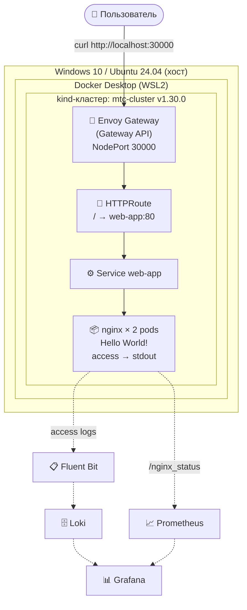

# MTC Engineer Hack — DevOps Case

Решение кейса «Развернуть веб-приложение в Kubernetes с Gateway API, мониторингом и логированием».

## 📋 Содержание

- [Архитектура](#архитектура)
- [Технологии и версии](#технологии-и-версии)
- [Требования к среде](#требования-к-среде)
- [Развёртывание](#развёртывание)
- [Проверка работоспособности](#проверка-работоспособности)
- [Мониторинг](#мониторинг)
- [Логирование](#логирование)
- [Известные ограничения](#известные-ограничения)

## 🏗 Архитектура



**Поток запроса:**
1. Пользователь → `http://localhost:30000`
2. kind → NodePort 30000 → под Envoy Proxy
3. Envoy Proxy → HTTPRoute `web-app` (prefix `/`)
4. HTTPRoute → Service `web-app:80`
5. Service → 2 пода nginx → ответ `Hello World!`

## 🛠 Технологии и версии

| Компонент | Версия | Назначение |
|-----------|--------|------------|
| Kubernetes | **v1.30.0** | Оркестратор |
| kind | v0.23.0 | Локальный кластер в Docker |
| kubectl | v1.36.1 | CLI |
| Helm | v3.15.0 | Пакетный менеджер |
| nginx | 1.27-alpine | Демонстрационное веб-приложение |
| Gateway API | v1.1.0 | Стандарт маршрутизации |
| Envoy Gateway | v1.1.0 | Реализация Gateway API |
| Docker Desktop | 29.8.0 | Контейнеризация (WSL2) |
| ОС хоста | **Windows 10** | Среда разработки |
| ОС в контейнерах | Ubuntu (kind node) | Совместимо с Ubuntu 24.04 |

## 📦 Требования к среде

- **ОС:** Windows 10/11 с WSL2 (или Linux с Docker)
- **Docker Desktop:** 4.x+ с включённым WSL2
- **RAM:** минимум 8 GB (Docker ограничен 4 GB)
- **CPU:** 2+ ядра
- **Диск:** 20+ GB свободно
- **Установлено:** `kubectl`, `kind`, `helm` (должны быть в `PATH`)

### Установка инструментов

Выберите удобный способ. Все команды выполняются в PowerShell
(Windows) или bash (Linux/macOS).

#### Вариант А: Chocolatey (Windows)

```powershell
choco install kubernetes-cli kind kubernetes-helm -y
```

После установки **закройте и откройте PowerShell заново**.

#### Вариант Б: winget (Windows 10/11)

```powershell
winget install -e --id Kubernetes.kubectl
winget install -e --id Kubernetes.kind
winget install -e --id Helm.Helm
```

#### Вариант В: Ручная установка

1. Скачайте бинарники:
   - kubectl: https://dl.k8s.io/release/v1.30.0/bin/windows/amd64/kubectl.exe
   - kind: https://kind.sigs.k8s.io/dl/v0.23.0/kind-windows-amd64
   - helm: https://get.helm.sh/helm-v3.15.0-windows-amd64.zip

2. Положите их в **любую папку**, которая есть в `PATH`.
   Например, создайте `C:\tools` и добавьте её в `PATH`:
   - Win+R → `sysdm.cpl` → Дополнительно → Переменные среды → Path → Создать → `C:\tools`

3. Для helm распакуйте zip и положите `helm.exe` в ту же папку.

#### Проверка

```powershell
kubectl version --client
kind --version
helm version
docker ps
```

Все 4 команды должны работать.

## 🚀 Развёртывание

### Шаг 0. Клонировать репозиторий

```powershell
git clone https://github.com/<ВАШ_НИК>/mtc-devops-case.git
cd mtc-devops-case
```

> ⚠️ **Все последующие команды выполняются из корня клонированного репозитория.**
> Путь `cd mtc-devops-case` — пример. У вас он может быть другим.

### Шаг 1. Создать kind-кластер

```powershell
kind create cluster --config kind-config.yaml
```

#### Проверка:

```powershell
kubectl get nodes
# NAME                        STATUS   ROLES           AGE   VERSION
# mtc-cluster-control-plane   Ready    control-plane   Xm    v1.30.0
```

### Шаг 2. Развернуть приложение

```powershell
kubectl apply -f k8s/app/
```

#### Проверка:

```powershell
kubectl get pods -n demo-app
# web-app-xxx   1/1   Running
# web-app-yyy   1/1   Running
```

### Шаг 3. Установить Envoy Gateway

```powershell
helm install eg oci://docker.io/envoyproxy/gateway-helm --version v1.1.0 -n envoy-gateway-system --create-namespace --wait
```

### Шаг 4. Создать Gateway API ресурсы

```powershell
kubectl apply -f k8s/gateway/gatewayclass.yaml
kubectl apply -f k8s/gateway/envoyproxy-nodeport.yaml
kubectl apply -f k8s/gateway/gateway.yaml
kubectl apply -f k8s/gateway/httproute.yaml
```

#### Проверка:

```powershell
kubectl get gatewayclass
# NAME   CONTROLLER                                      ACCEPTED
# eg     gateway.envoyproxy.io/gatewayclass-controller   True

kubectl get gateway -n demo-app
# NAME   CLASS   ADDRESS      PROGRAMMED
# eg     eg      172.18.0.2   True
```

## ✅ Проверка работоспособности

### 1. Проверка веб-приложения (напрямую)

```powershell
# в новом окне
kubectl port-forward -n demo-app svc/web-app 8080:80
# в первоначальном окне:
curl.exe http://localhost:8080
# Hello World!
```
### 2. Проверка через Gateway API

```powershell
curl.exe http://localhost:30000
# Hello World!

curl.exe http://localhost:30000/healthz
# ok
```

## 📊 Мониторинг
### 🚧 Раздел в разработке. Будет добавлено:

 * Установка Prometheus (kube-prometheus-stack или отдельно)

 * Настройка ServiceMonitor

 * Команда curl для проверки метрик

 * Пример PromQL-запроса

 * Grafana-дашборды

## 📝 Логирование
### 🚧 Раздел в разработке. Будет добавлено:

 * Установка Fluent Bit (или Fluentd)

 * Сбор access-логов nginx из stdout

 * Передача логов в Loki (или Elasticsearch)

 * Команда для проверки наличия логов

 * Просмотр логов в Grafana / Kibana

### ⚠️ Известные ограничения
 * Используется kind вместо kubeadm — допустимо условием, но kubeadm в приоритете.
   Решение можно перенести на kubeadm-кластер без изменений манифестов.

 * Gateway API реализован через Envoy Gateway — на kind требует NodePort
   вместо LoadBalancer (нет cloud-provider).

 * Порты 30000-30002 проброшены с хоста в kind-контейнер, поэтому NodePort
   Envoy Proxy жёстко зафиксирован на 30000.

 * Раздел «Мониторинг» — TODO.

 * Раздел «Логирование» — TODO.

 * Автоматизация — TODO (будет добавлен Makefile + deploy.sh)

```markdown
## 📌 Текущий статус разработки

Актуальное состояние проекта и список TODO — в файле [PROGRESS.md](PROGRESS.md).

**Кратко:**
- ✅ Kubernetes (kind v1.30.0)
- ✅ nginx с Hello World
- ✅ Gateway API (Envoy Gateway)
- 🚧 Prometheus — в работе
- 🚧 Fluent Bit + Loki — в работе
- 🚧 Автоматизация — в работе

Последнее обновление: в процессе работы над кейсом.